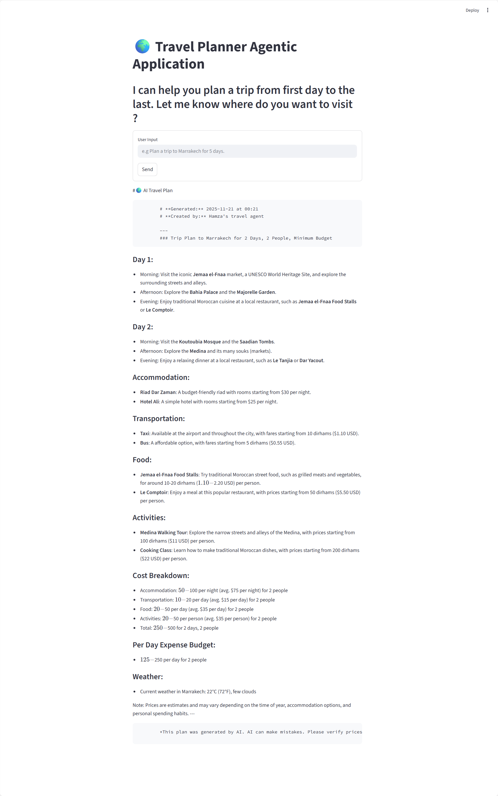

# Trip Planner Agent 

### Description :
An Agent AI for planning a trip to any city in the world using real time data 

### Agent capabilities :
1. Extract real time weather info
2. Extract attractions & activities for a specific city 
3. Extract available hotels and their costs for different days
4. Perform currency conversions
5. Itinery planning, what cities to visit and when
6. Perform calculations and estimate total travel expenses
7. Extract available modes of transportations in a city
8. Organize all the data above into a human comprehensive travel plan
9. Generate a summary of the trip

### Tools and APIs
1. Weather tools - current and forecast weather in any city
2. GOOGLE Map or Tavily Map for places searching (restaurants, attractions, activities, transportation etc.)
3. Currency conversion tools - to convert from any currency to any currency
4. Calculations - to perform different calculations of total expenses, individual shares and daily costs.

### System test screenshot 


### Tools 
- Python 3.11.14

### APP RUNNING
To run app, follow these steps:

1. Install python and create a virtual environement:

    ```uv python install cpython-3.11.14-windows-x86_64-none```

    ```uv venv env --python cpython-3.11.14-windows-x86_64-none```

2. Pull code to your local machine:

    `git pull https://github.com/HAJJINIHamza/AI_Trip_Planner.git`

3. Install dependecies, better use uv then pip:

    `uv pip install -r requirements.txt`

4. Open two different terminals (command prompt)

5. Activate your virtual environement on both terminals`

    `env\Scripts\activate.bat`

    or

    `.venv\Scripts\activate`

6. On the first terminal run app API endpoint:

    ```uvicorn main:app --reload --port 8000```

7. On the second terminal run streamlit application:

    ```streamlit run streamlit_app.py```

8. Use the Agentic AI to plan your trip

### First Commands History (To buil system from scratch):

```uv python list```

```uv python install cpython-3.11.14-windows-x86_64-none```

```python list```

```uv python list```

```uv venv env --python cpython-3.11.14-windows-x86_64-none```

```env/Scripts/activate```

```python venv/Scripts/activate```

```python env/Scripts/activate```

```C:\Users\hh\projects\AI_Trip_Planner\env\Scripts\activate.bat```

```uv pip list ``` 
